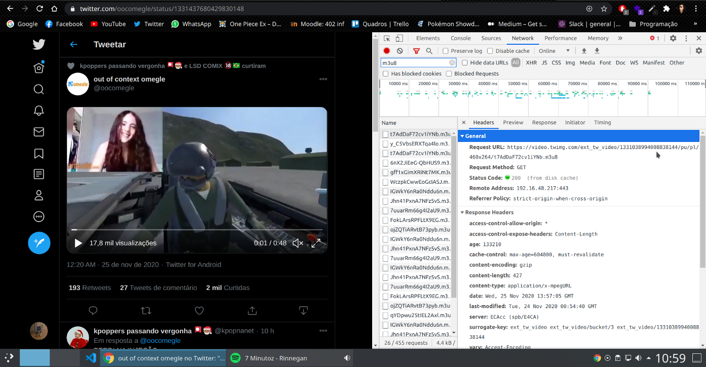
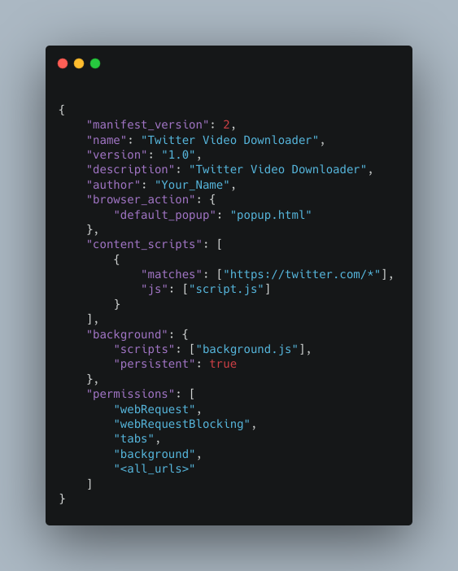
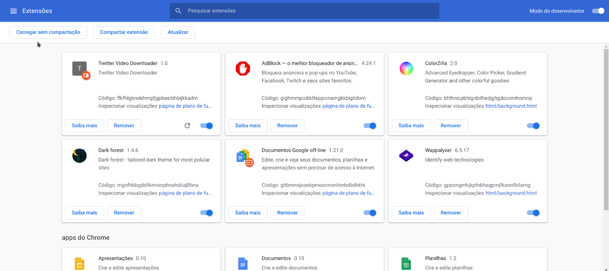
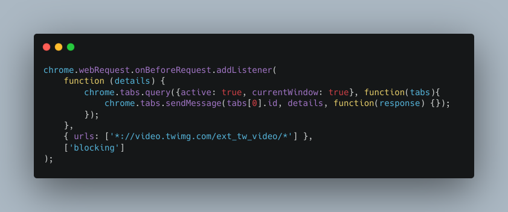

*Escrito originalmente em 26/11/2020*

# Tabela de Tópicos
- [**Introdução**](#introdução)
- [**Planejamento**](#planejamento)
- [**O Hello World das Extensões**](#o-hello-world-das-extensões)
- [**Scripts de Background**](#scripts-de-background)
- [**Conclusão**](#conclusão)

# Introdução
Um dos motivos que alavanca o Chrome em relação aos browsers competidores é sua extensa comunidade de extensões, levando os outros navegadores a integrar o sistema de extensões do próprio Chrome para seguirem relevantes. O ecossistema é rico em diversas soluções para uma navegação mais sofisticada em possibilidades, e a Google faz um ótimo trabalho em simplificar o desenvolvimento das extensões.

Nos próximos parágrafos, pretendo realizar uma introdução ao desenvolvimento de Chrome Extensions. O objetivo final é uma extensão personalizada para fazer o download de vídeos do Twitter. Como requisitos fica o conhecimento básico de HTML, CSS e Javascript.

# Planejamento
Antes de começar o desenvolvimento em si, vamos tracejar o caminho da extensão de forma manual. O Twitter utiliza para os vídeos o formato m3u8, que é derivado do m3u. Este tipo de arquivo armazena uma lista multimídia que será baixada quando executado. O 8 apenas significa que o formato será encodado em UTF-8 (para mais informações sobre UTF-8:
[https://developer.mozilla.org/pt-BR/docs/Glossario/UTF-8](https://developer.mozilla.org/pt-BR/docs/Glossario/UTF-8)).

Ao abrirmos o DevTools (Cntrl + Shift + I) podemos ir até a aba *Network*, onde é registrado todas as requisições realizadas pela página atual. Aplicando o filtro para apenas os arquivos m3u8 encontramos todos os vídeos (a lista é extensa pois o twitter pré-carrega vídeos quando eles ainda estão no fim da timeline). O *Request URL* disponibiliza o arquivo para acesso, porém sempre que se desejar um vídeo será necessário fazer todo o processo e encontrar a url correta do vídeo. Dito isto, vamos começar o desenvolvimento da extensão.

# O Hello World das Extensões
Nossa extensão será composta assim com um website comum, com HTML e CSS sendo opcionais e por majoritariamente scripts Javascript. Após ter uma pasta para o projeto criada, o primeiro arquivo será o *manifest.json*. Ele representa as configurações para que o navegador entenda o projeto como uma extensão.

- manifest_version: Versão de configuração do manifest;
- name, version, description, author: Informações sobre a extensão;
- browser_action: Ações que serão tomadas pelo browser, neste caso setamos para o popup do ícone de extensão que ficará na aba superior do navegador abra o arquivo popup.html. O browser_action também é utilizado para personalizar o ícone da extensão;

Os demais parâmetros passaremos adiante.

O arquivo *popup.html* é um html simples que será renderizado como apresentação da extensão quando o ícone for clicado.

Com isso temos o básico para a primeira execução da extensão, mas para isso precisamos adicioná-la ao navegador. Como ainda não a publicamos, utilizaremos a ferramenta de developer do Chrome. Vá até as extensões, ative o modo de desenvolvedor e vá na opção “carregar sem compactação”. Após isso basta selecionar a pasta do projeto e a extensão será adicionada.

Após modificar o código novamente, basta salvar os arquivos e clicar no ícone de recarregamento para a extensão ser atualizada.

# Scripts de Background

O Chrome disponibiliza diversas APIs para a integração de extensões com comportamentos do navegador. Declaramos as permissões da extensão na propriedade permissions do *manifest.json*.

Usaremos a API de WebRequest para interceptar as requisições feitas pela página (simulando a aba network do inspecionar), a API de tabs do navegador, liberamos acesso a todas as urls navegadas e a execução de scripts Javascript em background. Para baixar os arquivos m3u8, precisaremos separar nosso código em dois scripts separados. Um rodará em background capturando as urls, e o outro apresentará na tela o botão de download do arquivo.

Adicionamos um listener (escutador) ao webRequest, que interceptará todas as requisições feitas para a url base indicada (que é daonde vem todos os arquivos do twitter). Com a url em mãos, enviamos ela ao outro script por meio do chrome.tabs.sendMessage.

Por fim capturamos as mensagens com outro listener e utilizamos para o controle as variáveis video e locationUrl. Caso estejamos na home do twitter não será feito nada, e caso estejamos na mesma url que a última mensagem também não. Com isso, pegamos apenas o primeiro link que será enviado quando entramos no tweet de alguém, o que corresponderá ao vídeo postado. Com isso em mãos, renderizamos em tela um novo botão para o download do arquivo. Lembrando que na propriedade innerHTML qualquer visual pode ser passado, nesse caso utilizei o svg do ícone de compartilhar e o girei em 180 graus.

O resultado final é este:

O formato m3u8 pode ser convertido para mp4 ou outros em ferramentas online ou em programas como o VLC. Para quem quiser se aprofundar, o próximo upgrade da extensão seria converter o arquivo e baixá-lo pronto para o uso.

# Conclusão

Agradeço quem tenha lido e absorvido, por pequeno que seja, algum conhecimento. Deixo abaixo alguns links de materiais que utilizei para o estudo e o repositório do projeto no meu Github. Até mais!

[https://github.com/LuanSilveiraSouza/twitter-video-downloader](https://github.com/LuanSilveiraSouza/twitter-video-downloader)

[https://developer.chrome.com/docs/extensions/reference/webRequest/](https://developer.chrome.com/docs/extensions/reference/webRequest/)

[https://developer.mozilla.org/pt-BR/docs/Mozilla/Add-ons/WebExtensions/Your_first_WebExtension](https://developer.mozilla.org/pt-BR/docs/Mozilla/Add-ons/WebExtensions/Your_first_WebExtension)