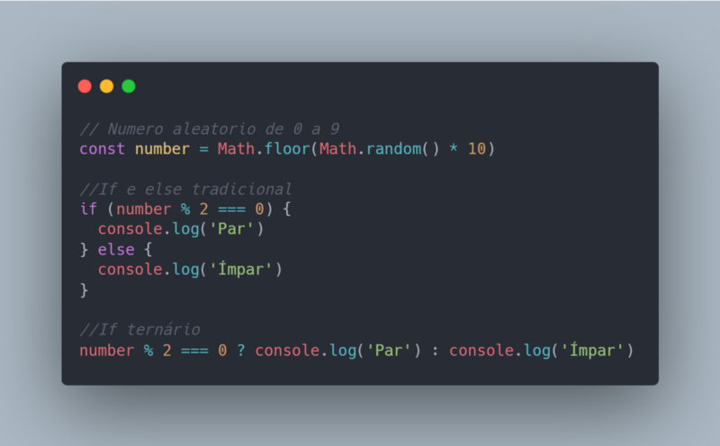

*Escrito originalmente em 03/06/2020*

# Tabela de Tópicos
- [**1 -  Estruturas de condição compactas**](#1-estruturas-de-condição-compactas)
- [**2 - Evitando erros no Input de funções**](#2-evitando-erros-no-input-de-funções)
- [**3 - Manipulação do DOM atualizada**](#3-manipulação-do-dom-atualizada)
- [**4 - Como lidar com a tipagem dinâmica**](#4-como-lidar-com-a-tipagem-dinâmica)

# 1 -  Estruturas de condição compactas
O If ternário é uma estrutura condicional adjacente aos já conhecidos if, else e else if. Ao utilizado, torna o código mais enxuto e organizado, contanto que restringido a sua função de execução de pequenos comandos complementares entre si e alinhados a representação de um "if" seguido de "else".

<!--truncate-->

# 2 - Evitando erros no Input de funções
Os parâmetros de funções permitem a declaração de um valor padrão, podendo evitar erros comuns de null, undefined e NaN na chamada de funções com algum dos parâmetros mal informado ou faltando.

# 3 - Manipulação do DOM atualizada
Em momentos de interação com a árvore de elementos HTML de uma página, opte por utilizar querySelector e querySelectorAll na busca de elementos. Além de performarem melhor e darem mais versatilidade ao programador comparado a métodos mais antigos como getElementById e getElementByClassName, estas novas funções incorporam nativamente usabilidades originadas da biblioteca JQuery.

# 4 - Como lidar com a tipagem dinâmica
Um dos pontos negativos do Javascript é que além de ter tipagem dinâmica ele também possui tipagem bagunçada. Brincadeiras a parte, a liberdade nos tipos das variáveis pode causar problemas sem o devido cuidado.
A presença de um símbolo de comparação de igualdade para valores brutos (==) e outro que leva em consideração também o tipo dos dados (===) junto da utilização do comparador typeof auxilia na gestão nos tipos das variáveis.

Para mais informações sobre os tópicos abordados aqui e outras diversas estruturas presentes no Javascript, recomendo a consulta na [Documentação da equipe Mozilla](https://developer.mozilla.org/pt-BR/docs/Web/JavaScript).
