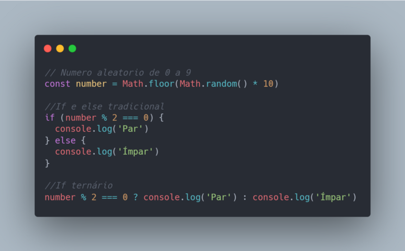
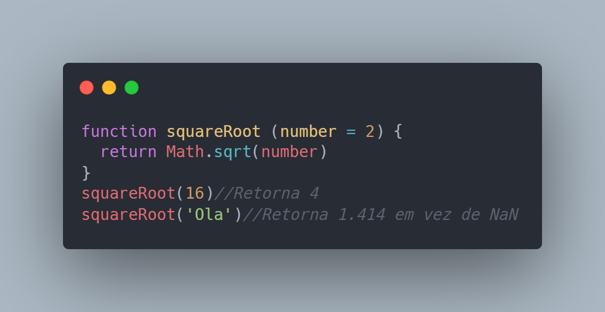
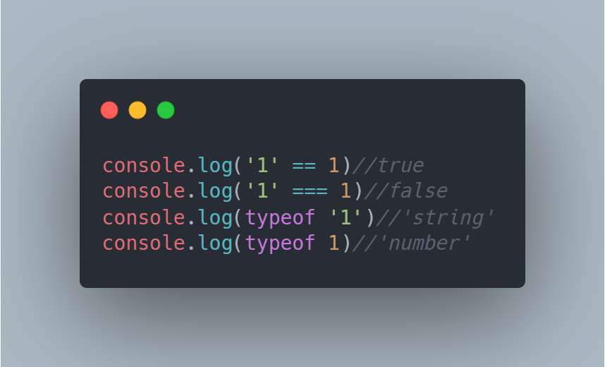

*Written originally on 2020/06/03*

One of the reason for the rise of Javascript in the last decade is the diverse forms for modern codewriting inserted in the language. I will present below 4 of these structures that help in development of efficient, concise and modern Javascript.

<!--truncate-->

# Tabela de Tópicos
- [**1- Compact conditional structures**](#1-estruturas-de-condição-compactas)
- [**2 - Avoiding errors in function Inputs**](#2-evitando-erros-no-input-de-funções)
- [**3 - Updated DOM manipulation**](#3-manipulação-do-dom-atualizada)
- [**4 -Updated DOM manipulation**](#4-como-lidar-com-a-tipagem-dinâmica)

## 1- Compact conditional structures
The ternary if is a conditional structure adjacent of the already know if, else and else if. When used, the code become more lean and organized, as long you restringe its use for his function of executing tiny commands complementary of each other.

## 2 - Avoiding errors in function Inputs
The function params alow default value declaration, who can avoid common errors related with null, undefined and NaN in function calls with some bad informed or missing param.

## 3 - Updated DOM manipulation
In the moments when you are interacting with the HTML element tree of a page, choose to use querySelector and querySelectorAll in element searching. Besides having best performance and giving more versatility to the programmer compared to older methods like getElementById e getElementByClassName, these new functions add utilities to native Javascript originated in JQuery library.

## 4 -Updated DOM manipulation
One of the most negative points of Javascript is its not only dynamic but messy typing. Jokes apart, the variables types freedom can cause several problems without proper care.

The presence of a symbol of equality comparation to brute values (==) and another where types of data matters (===) next to the use of comparator typeof helps a lot in variables types management.

To more informations about the approached topics inside this post and others structures presents in Javascript, I recomend the consult of the [Mozilla team documentation](https://developer.mozilla.org/pt-BR/docs/Web/JavaScript).
