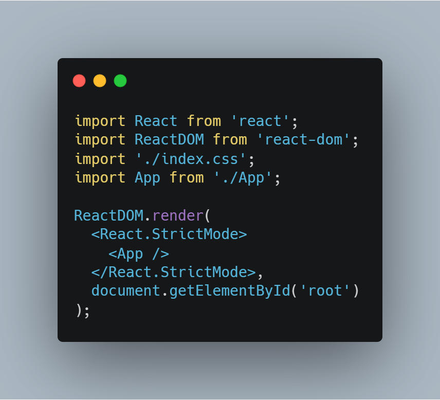
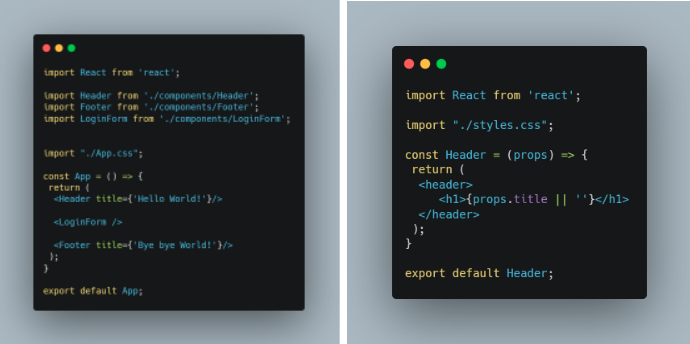

*Escrito originalmente em 28/09/2020*

# Tabela de Tópicos
- [**Introdução**](#introdução)
- [**Iniciando no React**](#iniciando-no-react)
- [**O JSX**](#o-jsx)
- [**React Hooks**](#react-hooks)
- [**Próximos Passos**](#próximos-passos)

# Introdução
O frontend não se resume mais a apenas Html, Css e Javascript há algum tempo. O que conhecemos como “Web Moderna” foi estruturado em volta dos inúmeros frameworks e bibliotecas Javascript criadas.
Entre elas, algumas se sobressaem e modelam o mercado: É o caso da trindade React, Angular e Vue (com menção ao Svelte que vem em pleno crescimento).

O React se apresenta como uma biblioteca Javascript para construção de interfaces componentizadas e, como o nome sugere, sistemas reativos e interativos. É atualmente um dos maiores projetos open-source do Github, com +150K de estrelas no repositório oficial, que foi criado e é mantido pelo Facebook.

# Iniciando no React
Para entender claramente o uso do React, o recomendado é já ter boas noções de Html, Css e Javascript. Algum contato com NodeJS também irá ajudar!

A forma mais rápida e prática para começar é utilizando o Create React App, outro pacote do npm criado pelo Facebook que visa contruir um template com a estrutura básica de um projeto em React.

Após rodar o comando acima e entrar na pasta, a estrutura será a seguinte:

Para quem se interessar no manifest.json e no serviceWorker.js, estes arquivos representam a possível abordagem de PWA no React. Mais informações neste [artigo](https://medium.com/@victoriwakawa/como-transformar-sua-aplica%C3%A7%C3%A3o-reactjs-em-um-pwa-e-ser%C3%A1-que-voc%C3%AA-deve-fazer-isso-567a8552c96d) sobre PWAs e quando utilizá-los.

O foco no início deve ser no index.js e no App.js, pois eles representam o start up de um projeto React. No index.html, a única tag dentro do body é uma div com id ‘root’, e será por essa div que o React se conectará com o html.

O React utiliza de outra biblioteca, o React-DOM, para representar a árvore de elementos html. Esta biblioteca gera um DOM virtual, isto é, todos os elementos são armazenados em memória e, quando há a atualização de um componente, apenas os componentes relacionados a este serão renderizados novamente. Esta estratégia é uma das principais do React para a construção de sistemas robustos porém performáticos.

# O JSX
No React podemos utilizar as tags Html junto do Javascript, e também criar nossas próprias “tags”, o que chamamos de componente. Por exemplo, podemos separar o Header, Navbar, Footer e o que acharmos necessário em componentes, aumentando o desacoplamento e a reutilização de código, além de outras estratégias eficientes para o uso de componentes controlados e não-controlados. A biblioteca responsável por isso é o JSX (Javascript in XML/HTML).

# React Hooks
Aqui mora uma das magias do React e de sua facilidade de lidar com a reatividade e a interatividade. Os Hooks são “gatilhos” inclusos no React que servem para diversas implementações, cada um com sua especificidade. Abordaremos aqui os 2 mais utilizados e must-know: useState e useEffect.

### useState

O useState nos permite o armazenamento de estados próprios do componente, e atualizar a tela sempre que o estado for atualizado.

O useState possui um formato diferente, pois não é uma variável convencional: ele segue o princípio da imutabilidade (da programação funcional), onde o valor não pode ser alterado, e quando se quer atualizar deve-se criar um novo valor imutável com base no anterior. Por isso utilizamos a função setCount para atualizar a contagem de cliques.

### useEffect

O useEffect invoca uma função de controle de ciclo de vida. Com ele, conseguimos executar subrotinas de acordo com o efeito colateral desejado.

O hook useEffect se alia muito bem ao useState, pois necessita de alguma informação para executar determinado efeito. O segundo argumento do useEffect é um array de dependências que controla a execução da função passada no primeiro argumento. Quando qualquer elemento dentro do array for atualizado, a função é disparada novamente. Caso o array esteja vazio, a função será executada apenas na **montagem do componente**.

# Próximos passos

Com o apresentado aqui já é possível construir muitas interfaces interessantes usando o melhor do React. A prática leva a perfeição (ou o mais próximo possível disso), portanto recomendaria a construção de um site simples utilizando React que se integre com alguma API. Com os hooks essa tarefa se torna extremamente trivial, e caso esteja sem ideias o repositório [Awesome APIs](https://github.com/TonnyL/Awesome_APIs) armazena uma coleção de recursos muito legais para projetos do gênero.

Ademais, é isso. Quem chegou até aqui, agradeço pela leitura e bons estudos!