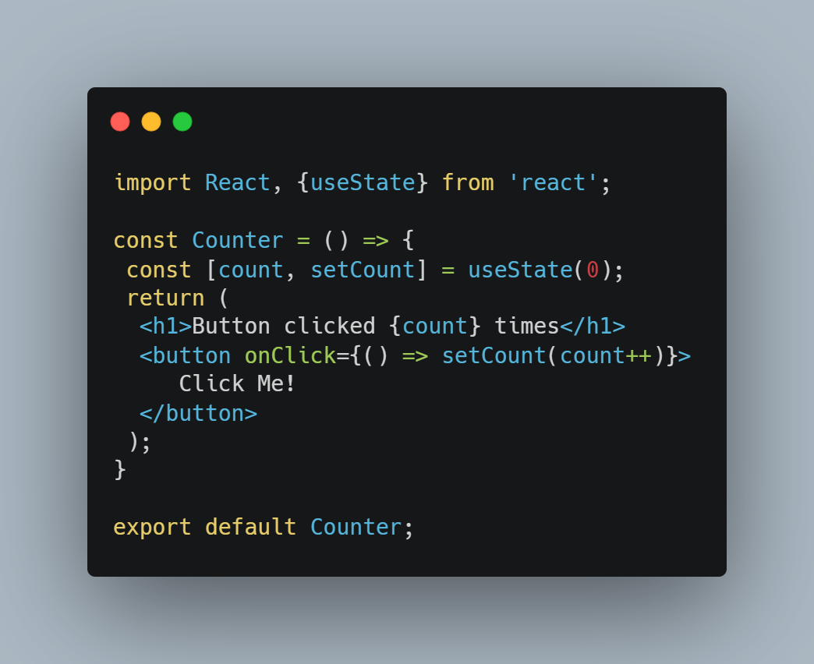
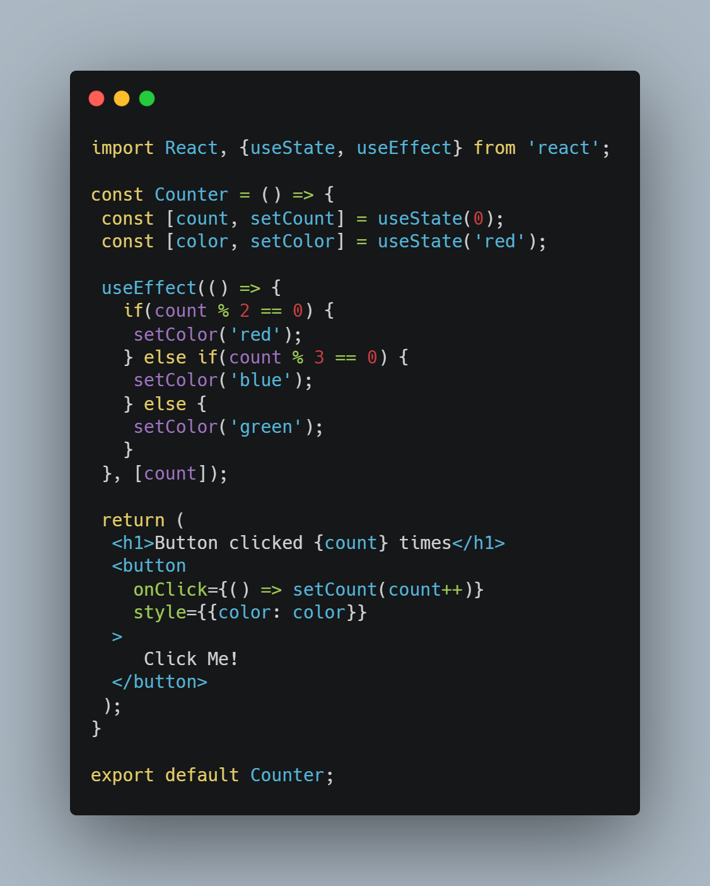

*Written originally on 2020/09/28*

The frontend doesn’t summarize itself to just Html, Css and Javascript in some time. What we know as “Modern Web” has been structured around countless Javascript frameworks and libs. Some of them stand out and shape the ecosystem: that’s the case of React, Angular and Vue (with a mention for Svelte, which is growing a lot).

<!--truncate-->

React shows itself as a Javascript lib for making componentized interfaces and as the name suggests, reactive and interactive systems. Currently is one of the biggest open source projects of Github, with more than 150K stars in the official repository, who was created and are maintained by Facebook.

# Tabela de Tópicos
- [**Starting in React**](#starting-in-react)
- [**JSX**](#jsx)
- [**React Hooks**](#react-hooks)
- [**Next Steps**](#next-steps)

## Starting in React
To understand clearly React, is recommended to already have good notions of Html, Css and Javascript. Some contact with NodeJS will help too!

The most fast and practical way to start is using Create React App, another npm package created by Facebook which aims to build a template with the basic structure of a React project.

After running the command above and going to the folder, the structure will be as follows:

For who have interests in manifest.json and serviceWorker.js, these files represents the possible PWA approach in React. More info in this [article](https://medium.com/@victoriwakawa/como-transformar-sua-aplica%C3%A7%C3%A3o-reactjs-em-um-pwa-e-ser%C3%A1-que-voc%C3%AA-deve-fazer-isso-567a8552c96d) sobre PWAs e quando utilizá-los.

The focus in the beginning should be in index.js and App.js because they represents the start up of a React project. In index.html, the only tag inside body is a div with the root id. This div will be the connection between React and Html.

The React uses another lib (React-DOM) to represents the Html elements tree. This lib generates a virtual DOM that caches all elements in memory, so when a component updates only the components related to it will be renderized again. This strategy is one of the main principles of React to build robust but performatic systems.

## JSX
In React we can use Html tags with Javascript and create our own “tags”, what we call component. For example, we can divide the Header, Navbar, Footer and what we think that are useful create a separated component. This approach increase decoupling and code reutilization, besides other efficient strategies of controled and non-controled components. The lib responsible for that is the JSX (Javascript in XML/HTML).

## React Hooks
Here we have one of the React magics to handle with reactivity and interactivity. The Hooks are “triggers” included in React that serve diverse implementations, each one with your specificity. We willl show here the two most important hooks: useState and useEffect.

### useState

The useState allow to store states that belong to the component and updates the screen when the state is updated.

The useState possess a different format, because it’s not a conventional variable: it follows the immutability principle (of functional programming), where values cannot be changed and to update it should create a new immutable value based on the previous value. Because of that we use the setCount function to update the clicks count.

### useEffect

The useEffect invokes a lifecycle function. With it we can execute subroutines according of the desired collateral effect.

The useEffect hook allies pretty well with useState, because it needs of some information to trigger the function. The second argument of useEffect is a array of dependencies that controls the first argument function. When any element inside of the array is updated, the function is executed again. In case of the array is empty, the function will be executed only in the component mount.

## Next Steps

With the showed here it’s possible to build so much interesting interfaces using the best of React. The practice leads to perfection (or the most close to it), so I recommends the construction of a simple website using React that integrates with some API. With hooks this task becomes bread and butter and, if you are out of inspiration, the [Awesome APIs](https://github.com/TonnyL/Awesome_APIs) repository index a lot of good resources to make projects with React.

Furthermore, that’s it. Thanks to who got to there and good studies!