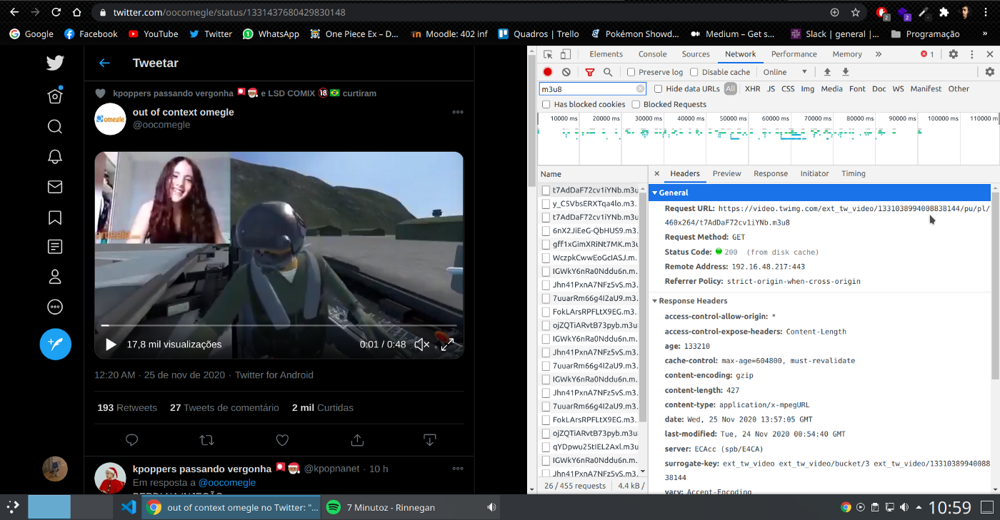

*Written originally on 2020/11/26*

One of the reasons that Chrome shows itself superior to other browsers is its huge extension community, leading everyone to integrate its system to remain relevants. The ecossystem is rich in a diverse of solutions to a more sophisticated navigation, and Google makes a great job simplifying the extension development.

<!--truncate-->

In the next paragraphs, I pretend to introduce to Chrome Extensions development. The final objective is a extension to download videos of Twitter. The prerequisites to follow this post is the basic knowledge of HTML, CSS and Javascript.

# Tabela de Tópicos
- [**Planning**](#planning)
- [**The Extension’s Hello World**](#the-extensions-hello-world)
- [**Background Scripts**](#background-scripts)
- [**Conclusion**](#conclusion)

## Planning
Before we start the development, let’s trace the path of the extension functionality manually. Twitter uses the m3u8 format to render the videos, which is derived of m3u. This type of file stores a multimedia list that will be downloaded when executed. The 8 only means that the file will be UTF-8 encoded. (To more info about this:
[https://developer.mozilla.org/pt-BR/docs/Glossario/UTF-8](https://developer.mozilla.org/pt-BR/docs/Glossario/UTF-8)).

After opening DevTools (Cntrl + Shift + I) we can go to Network tab, where all requests made by the current page are registered. Applying a filter to only show m3u8 files we find all the loaded videos (the list is extense because Twitter preloads videos when its still at the end of the timeline). The Request URL makes available the file to access, but whenever you want a video, you have to do all that process and find the correct url for the video. With this being said, let’s start the development.

## The Extension’s Hello World
Our extension will be composed as a common website, with HTML and CSS being optional and with mostly JS scripts. After a project folder create, the first file will be manifest.json. It represents the configurations to the browser understand this project as a extension.

- manifest_version: Configuration version of the manifest;
- name, version, description, author: Infos about the extension;
- browser_action: Actions that are going to be taken by the browser, in this case we setup to the file popup.html opens when the extension icon is clicked. The browser_action is used to add a custom icon to the extension.

The other parameters will be passed on.

The popup.html file is a simple html that will be renderized as a presentation of the extension when the icon is clicked.

With that we have the basic to a first execution of the extension, but for that we need to add it to the browser. Since we haven’t published it yet, we will use the developer tool of Chrome. Go to extensions, activate the developer mode and go to the option “Load without compaction”. After this just select the project folder and the extension will be added.

After modifying the code, just save the files and click in the reload icon to the extension be updated.

## Background Scripts

The Chrome exposes a few APIs to extension integration with browser behaviors. We declare the permissions in the manifest.json.

We will use the WebRequest API to intercept the requests made by the page (simulating the network tab of the inspect), the Tabs API, the access to all urls and the execution os JS scripts in background. To download the m3u8 files, we will need to split our code in two scripts. One will run in background capturing the urls, and the other will show in the UI a download button of the file.

We added a listener to the webRequest that will intercept all requests made to the appointed base url. With that url in hands, we send it to the other script with chrome.tabs.sendMessage.

Lastly we capture the messages with another listener and use the variables video and locationUrl. In case the page is in Twitter home or in the same url of the last message nothing will happen. With that, we take only the first link that will be sent when we enter someone’s tweet, which will correspond to the posted video. To the UI, we render in the screen a new button of the file download. Remembering that the innerHTML property can take whatever design you want, in this case I used the same svg that the share icon uses and turn it in 180 degrees.

The final result is this:

The m3u8 format can be converted to mp4 or other in online tools or in programs like VLC. To who wants to make a more deeply study, the next upgrade would be to the extension convert the file and download it ready to use.

## Conclusion

I thank those who have read and absorbed, however small, some knowledge. I leave some links below of materials that I used to study this and the project repository in my Github. Bye bye!

[https://github.com/LuanSilveiraSouza/twitter-video-downloader](https://github.com/LuanSilveiraSouza/twitter-video-downloader)

[https://developer.chrome.com/docs/extensions/reference/webRequest/](https://developer.chrome.com/docs/extensions/reference/webRequest/)

[https://developer.mozilla.org/pt-BR/docs/Mozilla/Add-ons/WebExtensions/Your_first_WebExtension](https://developer.mozilla.org/pt-BR/docs/Mozilla/Add-ons/WebExtensions/Your_first_WebExtension)