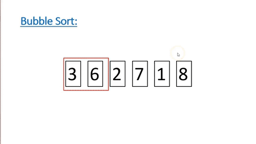
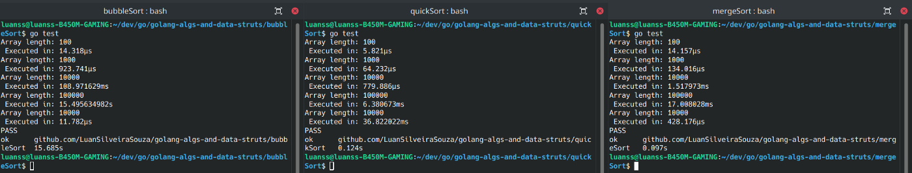

*Written originally on 2021/05/01*

In the beginning of computation and programming studies, it’s essential that besides programming logic and common strucures of all programming languages (such as conditionals and repeat loops) be deepened knowledgements about data structures and algorithms.

<!--truncate-->

However, there are some concepts that only make sense when the programmer start to work in real projects, where people uses its systems and many factors come up, such as performance and response speed of the applications.

The code writed by software developers include not only all the needed logic for its purposes, but together with that comes a subjective factor, being possible to realize the decisions and the way of thinking of the programmer. Knowing that, the asymptotic complexity describes the start point of the performatic analysis of algorithms.

# Tabela de Tópicos
- [**Asymptotic complexity and the Big O**](#asymptotic-complexity-and-the-big-o)
- [**Algorithms comparison**](#algorithms-comparison)

## Asymptotic complexity and the Big O
In computers science, the asymptotic complexity is the study of the execution speed of algorithms given the input growth factor. It’s worth to point that the asymptotic complexity doesn’t consider the technology and programming language details, focusing in the teoric and mathematic approach.

The Big O is a notation created to simplify all asymptotic complexity understanding. Considering a quantity n, Big O classify algorithms accordingly the execution time grows given that n tend to infinity, showing all this process with function graphics.

The above graphic show the most common Big O values. It’s perceptibe that O(n log n) e O(n) have a constante grow in execution time, for example. Algorithms from O(n²) upwards should be avoided, because its response time becomes exponential and in cases of a great input quantity it will not be satisfatory. The exponentiality generally is connected with algorithm’s processes, being the most common of them the nested repeat loop (one repeat loop inside other), what causes intense processing and consequently slowness.

## Algorithms comparison

As a practical example, there was selected 3 well know list sorting algorithms. As the purpose isn’t the algorithms in itself, it will be only showed a brief explanation of each one.

The Bubble Sort is one of the most basic sorting algorithms. It consists in switch two adjacent elements when they are in wrong order and repeating that process until all the list is sorted.

The Quick Sort uses a pivot element to split the array in elements smaller than the pivot in left and elements bigger than the pivot in right, following the same logic recursively to all sublists of both sides.

The Merge Sort separates the list until its most tiny size possibble (it’s created a list to every singular element). After that the adjacent lists are merged and the array is sorted recursively.

The 3 algorithms was submited to a test battery with the same lists. The collection used was a array with 100 values, a with 1.000 values, a with 10.000 values, a with 100.000 values and a special with 10.000 values that was already sorted.

Below are their performance (remembering that 1 s = 10^-3 ms = 10^-6 µs):

Because Bubble Sort is more simple, it has a low performance in big arrays, reaching O(n²) in its worst cases. However, in a already sorted list it is the one that performs best due to the fact that it only pass in the list without doing any operation.

The Quick Sort possesses the best performance with great amounts of input, however in a already sorted list its logic don’t goes very well.

The Merge Sort shows the best medium performance, handling with big lists with dexterity without losing performance in cases where the list is already sorted.

The algorithm analysis exercise is improved with practice and the decision and confidence power adquired by who uses Big O certainly adds value to the developer autonomy and its potential to impact even more with its solutions.

The algorithms was implemented using Golang and can be accessed in my Github: [https://github.com/LuanSilveiraSouza/golang-algs-and-data-struts](https://github.com/LuanSilveiraSouza/golang-algs-and-data-struts)

Thanks to the reading and bye bye!