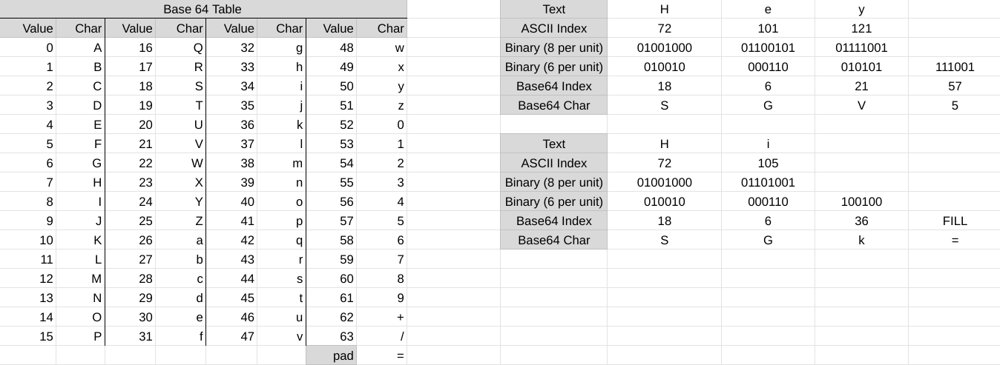

*Escrito originalmente em 05/01/2021*

# Tabela de Tópicos
- [**Introdução**](#introdução)
- [**Concepções sobre encoding, encrypting e hashing**](#concepções-entre-encoding-encryption-e-hashing)
- [**Como Base 64 funciona**](#como-base-64-funciona)
- [**Implementando Base 64 em Golang**](#implementando-base-64-em-golang)
- [**Considerações finais**](#considerações-finais)

# Introdução
Em algum momento de seus estudos em programação/ciência da computação, você irá se deparar com o encoding. Se você iniciou com HTML, por exemplo, uma das tags importantes de se incluir no ```<head>``` é a ```<meta charset>```. Esta tag expõe ao navegador que irá montar a árvore de elementos HTML qual tipo de codificação ele deve utilizar para mostrar apropriadamente os caracteres do arquivo.

Encoding é o processo de representar caracteres a vida real em um computador. Como computadores entendem apenas binário, foi criado uma série de algoritmos e padrões para ligar coleções de símbolos a números binários.

Além disso, encoding possui a responsabilidade de garantir que os dados que transitam pela internet se mantenham íntegros. Neste contexto, temos o Base 64, um formato de encoding que mapeia apenas 64 caracteres (o que é uma pequena quantidade comparado a outros métodos comuns, como ASCII e Unicode) e é utilizado para transmitir dados entre clientes e servidores. É útil não apenas para texto simples, mas também para anexos de emails e imagens.

# Concepções entre encoding, encryption e hashing
Um desentendimento comum que pessoas novas na ciência da computação possuem é saber a diferença entre estes 3 processos. Como vimos antes, encoding é apenas a representação de textos/arquivos em um formato específico que computadores consigam entender os dados como dados binários. Encoding não deve ser utilizado para proteger dados, pois este foi criado de forma ao decoding ser extremamente simples.

*Encryption* é o processo onde os dados são passados por um algoritmo que o transforma em textos incompreensíveis. Esses algoritmos agem com um conjunto de chaves que permitem diferentes entidades encriptar e decriptar. Normalmente, é implementado uma chave pública para encriptar dados, e apenas quem possui a chave privada consegue decriptar a mesma informação. O propósito aqui é trocar dados com segurança e confiabilidade.

*Hashing*, semelhante a encriptação, passa os dados num algoritmo que os transforma em uma massa de símbolos e letras aleatórias, com o detalhe que no hashing não há o processo reverso. Isto significa que dados transformados não podem ser revertidos. Se um hash é inserido no algoritmo novamente este apenas gera outro hash, e assim adiante. Hash é o procedimento mais seguro, portanto é utilizado em dados sensíveis que necessitam de ser armazenados e persistidos, como senhas de usuários em banco de dados de sistemas.

# Como Base 64 funciona

Base 64 usa a tabela ASCII como referência para transformar textos na internet. Ele transpila todos os caracteres em binários ASCII e muda a seleção de byte (8 bits) a byte para 6 bits a 6 bits. Dessa forma, cada unidade possui 6 bits, com um máximo de 64 caracteres. Finalmente, a tabela converte estas coleções de bits para sua representações da tabela Base 64.

Abaixo temos todos os passos e a tabela Base 64 para referência:



Se você está acostumado a manipular bits, você provavelmente já se questionou: mudando de 8 para 6 bits por unidade algumas vezes criará uma coleção de caracteres com valores faltando. Quando isso acontece (e leia isso como: quando a string de input não possuir comprimento divisível por 3) o algoritmo precisa preencher os bits remanescentes com 0 e o último um ou dois elementos com um caractere de pad (=).

Obs: É importante notar que o Base 64 não é o melhor para performance, com ele aumenta o tamanho da string em 33%.

# Implementando Base 64 em Golang

Golang possui em suas bibliotecas nativas métodos para encode e decode de Base 64. Mas para entendermos completamente, implementaremos do zero.


À primeira vista parece bastante código, E realmente é (considerando uma funcionalidade já inclusa na linguagem). Mas tudo que é feito aqui é o mesmo dos passos feitos na imagem anterior. Primeiro, a string é convertida em cada um de seus caracteres para ASCII. Então, transforma em bytes, depois para pacotes de 6 bits. Usamos uma lista que representa a tabela Base 64 e uma função auxiliar arrayFind para mapear cada um desses pacotes para um dos índices do array, e por fim, se necessário, é adicionado um ou dois ‘=’ símbolos para lidar apropriadamente com os casos de exceção resultando na string Base 64 final.

# Considerações finais

Há outros métodos importantes de encoding que devem ser entendidos, como o Unicode, mas não abordamos neste post.

Por fim, todo o código e conceitos apresentados aqui são baseados em um dos meus estudos, uma aplicação de terminal escrita em Golang para realizar encode e decode entre formatos, incluindo ASCII e Base 64. Você pode encontrar o repositório em meu Github: [https://github.com/LuanSilveiraSouza/cnvrtr](https://github.com/LuanSilveiraSouza/cnvrtr)

Espero que este post trouxe algum conhecimento a você! Obrigado por ler!