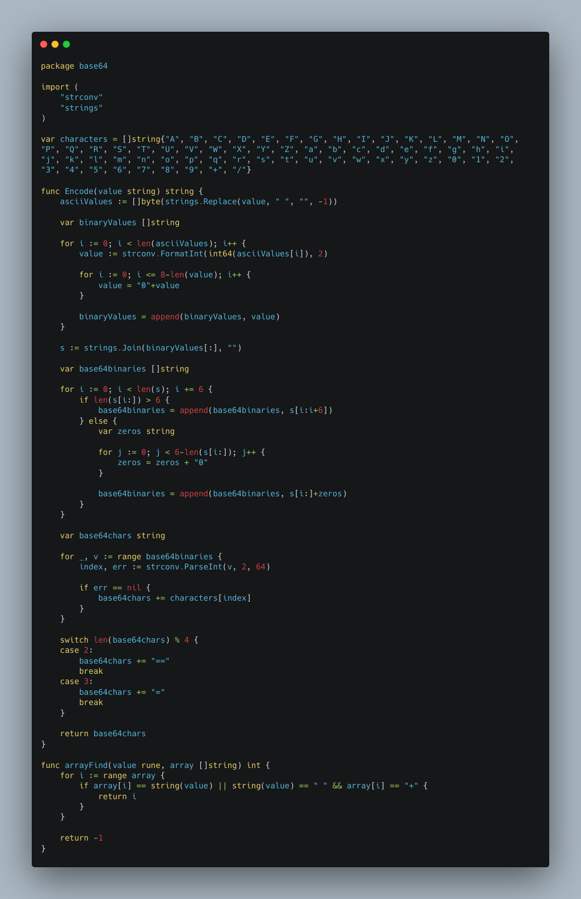

*Written originally on 2021/05/01*

In some time of your studies in programming/computer science you will encounter the encoding subject. If you started with HTML, for example, one of the most important tags that the ```<head>``` needs is the ```<meta charset>```. This tag exposes to the browser that will mount the HTML tree what kind of encoding it have to use to properly shows the characters included in your file.

<!--truncate-->

Encoding is the process to represent real life characters in a computer. Because computers only understand binary codes, there has been made a bunch of algorithms and patterns to match a collection of symbols to binary numbers.

Besides that, encoding has the responsibility to ensure that data that transits in the internet remain integral. In this context, we have the Base 64, a encoding format that maps only 64 characters (which is a low quantity if compared to other commonly used encoding, like ASCII and Unicode) and is used to transmit data between clients and servers. It is very useful not only for plain text, but it can encode email attachments and images too.

# Tabela de Tópicos
- [**Misconceptions between encoding, encryption and hashing**](#misconceptions-between-encoding-encryption-and-hashing)
- [**How Base 64 works**](#how-base-64-works)
- [**Implementing Base 64 in Golang**](#implementing-base-64-in-golang)
- [**Final considerations**](#final-considerations)

## Misconceptions between encoding, encryption and hashing
A common struggle to new people in CS is to don’t know the difference between these 3 processes. As we saw above, encoding is only a representation of a text/file in a specific format that computers can understand its data as binary data. It should not be used to protect data, as it is pretty easy to decode back.

*Encryption* is a process when data is passed in a algorithm that transforms it in a incomprehensible text. These algorithm acts with a set of keys that enables different entities to encrypt and decrypt it. Usually, it is implemented a public key to encrypt data, and only who has access to the private key can decrypt the same information. The encryption purpose is to exchange data with security and reliability.

*Hashing*, similar to encryption, passes the data in a algorithm that transforms it in a mass of random symbols and words, but the detail in hashing is that it don’t have reversion. This means that the data transformed cannot be rolled back. If the hash is inputted again in the algorithm it will only generate another hash, and so on. Hash is the most secure procedure, and it is used in sensitive data that wants to be stored and persisted, as password of users in a system database.

## How Base 64 works

Base 64 uses the ASCII table as a reference to transform texts in the internet. It consists on transpile all the characters to the binaries ASCII representations and change the selection from byte (8 bits) per byte to 6 bits per 6 bits. In that way, each unit of code has 6 bits, with a maximum of 64 characters. Finally, a table converts this collections of bits to its matching representations.

Below we have all steps and the Base 64 table for reference:


If you are used to manipulate bits, you already have made a question: changing from 8 to 6 bits per unit will often cause a collection of characters to remain missing some values. When that happens (and read that by: when the input string don’t have a length divisible by 3) the algorithm needs to fill the remanescent bits with 0 and the last one or two elements with a pad character (=).

Obs: It is important to note that Base 64 is not the best for performance, as it grows the string by 33%.

## Implementing Base 64 in Golang

Golang has in its built-in libs methods do encode and decode Base 64. But to fully understand it, we will implement from zero.



At a first glance it seems like a lot of code. And it really is (to a functionality already done in the language libs). But all that is being done here is the same as the steps made in the previous image. First, the text string is converted each of his characters to ASCII. Then, it transforms them into bytes, then to 6 bits packages. We use a list that represents the Base 64 table and a auxiliary function arrayFind to match each of the 6 bits pack to one index of this array, and in last, if needed, it is added one or two ‘=’ symbols to properly handle with the exception cases, resulting in the final Base 64 encoded string.

## Final considerations

There are other important encoding methods to understand, like Unicode, that we don’t cover in this post.

Lastly, all the code and concepts presented here are based in one of my studies, a Golang terminal application to encode and decode between formats, including ASCII and Base 64. You can check the repository at my Github: [https://github.com/LuanSilveiraSouza/cnvrtr](https://github.com/LuanSilveiraSouza/cnvrtr)

I hope this post has bring some knowledge to you! Thanks to read!