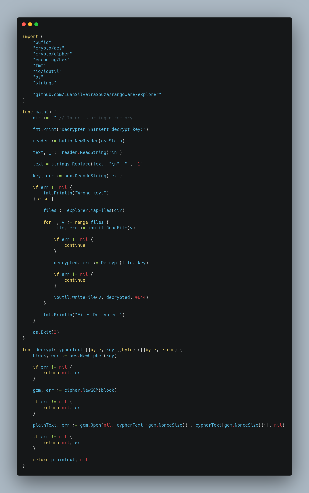

*Escrito originalmente em 16/04/2021*


*“O que não consigo criar, não entendo”* — Richard Feynman

Eu acho que essa frase de Richard Feynman, um importante físico do século passado, resume bem a sensação que todo programador passa em seus estudos.

<!--truncate-->

Neste caminho, eventualmente todos se encontram com a área de Segurança da Informação (ou com um linguajar da moda, Hacking). É como o ying yang: programadores devem ter um pouco de hackers e vice versa.

# Tabela de Tópicos
- [**Um pouco de história**](#um-pouco-de-história)
- [**Estrutura básica**](#estrutura-básica)
- [**Implementação em Golang**](#implementação-em-golang)
- [**Considerações finais**](#considerações-finais)

Algumas semanas atrás me fiz um questionamento: Como ransomwares funcionam? Acabei que estudei algumas implementações públicas e aqui estou para apresentar um pequeno exemplo de um dos tipos de cyber attacks mais usados hoje em dia.

# Um pouco de história
Os primeiros registros de ataques por ransomware bem sucedidos datam de 2005, mas foi na última década que as ocorrências explodiram.

Por conta de sua natureza, ransomwares são tipicamente usados com grandes companhias como alvos. Alguns exemplos são o CryptoLocker e o WannaCry, dois ransomwares que infectaram milhares de máquinas e causaram um grande estrago.

Há duas maneiras que hackers tornam ransomwares uma grande ameaça. Primeiro, há bugs e backdoors descobertos em redes e em sistemas operacionais que permitem a injeção de software malicioso que infecta todas as máquinas conectadas, seja pela rede ou por conexão física (como pendrives e outros dispositivos plug-and-play).

As companhias por trás desses sistemas (Microsoft, empresas de antivírus, etc) desempenham um grande esforço combatendo as falhas e as corrigindo. Portanto também é muito utilizado o clássico phishing, camuflando o malware em PDFs, executáveis e outros conteúdos baixáveis.

# Estrutura básica

Ransomwares são essencialmente programas que escaneiam todos os arquivos e os encriptam. Os arquivos são “sequestrados”, pois o hacker exige um pagamento de resgate (comumente com bitcoin ou outra cryptomoeda por conta da anonimicidade das transações) para enviar a chave de descriptografia.

Se a vítima não possui backups, provavelmente não há muito o que ser feito além de pagar o criminoso. Mas até isto é bem arriscado, dado o fato que muitos deles não enviam a chave mesmo após o pagamento. A solução mais efetiva é estabelecer protocolos de segurança e configurar backups frequentes.

Além do software que permanece na máquina da vítima, muitas vezes é utilizado um servidor de comando. O servidor recebe dados de todas as vítimas que tiveram seus dados encriptados e fica responsável por checar o status do pagamento para o envio da chave de descriptografia.

# Implementação em Golang

A primeira parte é o explorador de arquivos. Com ele, conseguiremos “caminhar” por todos os diretórios desde a raiz ou especificando um diretório de início customizado.


Na primeira seção, detectamos se SO é Windows ou Linux para pegar o diretório home correto (adicionar suporte a Mac seria o mesmo processo). Podemos especificar um diretório de início, ou o programa iniciará em /Downloads/Test. Este mecanismo previne execuções de teste de encriptar todos os arquivos na máquina. Então mapeamos e armazenamos os arquivos com filepath.WalkDir, retornando um array.

Agora, precisamos de um programa auxiliar para gerar chaves de encriptação/decriptação. Escolhi o algoritmo AES-256-GCM, então é necessário uma chave de 32 bytes (para combinar com os 256 bits do algoritmo). Usaremos a mesma chave para as duas operações, mas num cenário realístisco o recomendado seria o uso de encriptação assimétrica (uma pública e uma privada).


Depois iremos fazer o encriptador. Ele recebe, além da chave, um diretório de início e um email de contato. Usaremos a função MapFiles() para conseguir os arquivos, encriptá-los e reescrevê-los. Por último, um readme é gerado, informando a vítima que seus dados foram sequestrados e um contato para conseguir o programa de decriptação.


O decriptador é muito semelhante ao encriptador, apenas invertendo a ordem das operações.



# Considerações finais

Para rodar todas as partes do programa, use ‘go build’ para gerar os executáveis para as plataformas e arquiteturas necessárias. Por exemplo, para gerar para Windows use:

```$env GOOS=windows go build```

Não esqueça de previamente gerar uma chave criptográfica e inserí-la nas variáveis (key, dir e contact).

Há algumas coisas que podem ser adicionadas e melhoradas no projeto. Criar um servidor de controle, integrar com pagamento de criptomoedas, usar concorrência do Go para melhorar a performance de leitura, encriptação e escrita de grandes porções de arquivos, e por aí vai.

[https://github.com/LuanSilveiraSouza/rangoware](https://github.com/LuanSilveiraSouza/rangoware)

Espero que este post foi útil a você! Obrigado por ler!