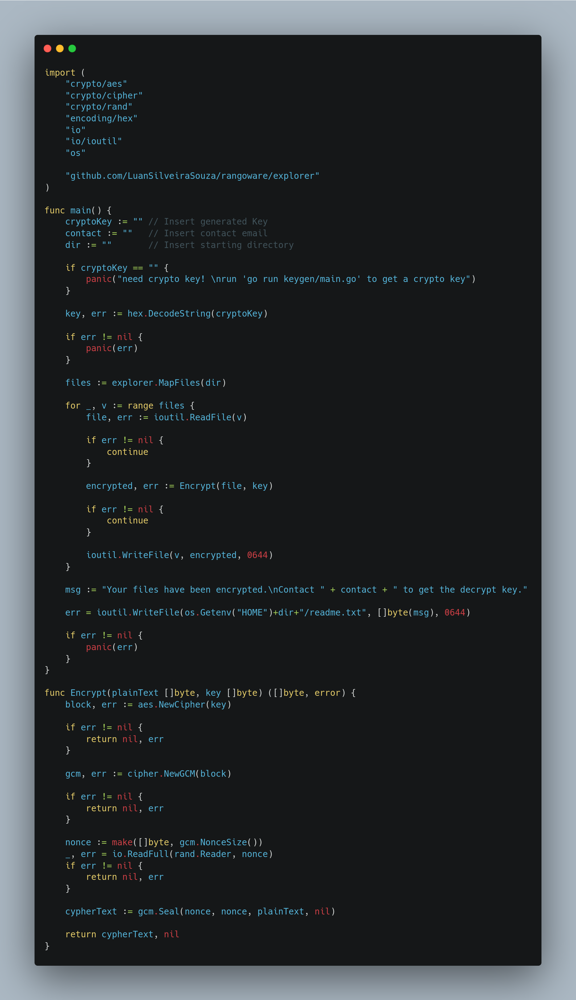

*Written originally on 2021/04/16*


*“What I cannot create I do not understand”* — Richard Feynman

I think that this quote from Richard Feynman, a important Physicist from the past century, summarize very consistent the feeling that every programmer has with its studies in the area.

<!--truncate-->

In this path, eventually everyone will face the InfoSec area (or with a more hyped term, Hacking). It is like the ying yang: programmers should have a foot in the camp of hacking, and vice versa.

Some weeks ago I made myself the question: How a Ransomware works? I have studied some public implementations and here I am to show a little example of one of the most used type of cyber attack in these days.

# Summary
- [**A bit of history**](#a-bit-of-history)
- [**Basic structure**](#basic-structure)
- [**Golang Implementation**](#golang-implementation)
- [**Final Considerations**](#final-considerations)

## A bit of history
The first solid registries of sucessful ransomware attacks date from 2005, but in the last decade that the attacks bursted in number of ocurrences.

Because of its nature, ransomwares are typically used with big companies as targets. Some examples are CryptoLocker and WannaCry, two ransomwares that infected thousands of machines and caused a lot of damage.

There has two approaches that attackers use to make ransomwares a big threat. First, there has bugs and backdoors discovered in networks and operational systems that enables hackers to inject a malicious software that infects all machines connected, either through the network or even physically connected (like pendrives and another plug-and-play devices).

There it has a big effort by companies behind theses systems (Microsoft, antiviruses, etc) to detect these faults and correct them. So attackers use the traditional approach of phishing, camouflaging the malware in PDFs, executables or another downloadable content.

## Basic structure

Ransomwares are essentially a program that scans the file system and encrypt the files. The files are kind of kidnapped, as the attacker requires a ransom payment (commonly with bitcoin or another cryptocurrencies, because the anonymity of the transactions) to provide a key to decrypt the files.

If the victim doesn’t have a backup of the files, probably there’s no action to do other than pay the attacker. But event that is very risky, because a lot of attackers don’t send the decrypt key even with the payment. The most effective solution is estabilish security protocols and setup frequent backups.

Along with the software that stays in the victim’s machine, there is common the use of a command server. This server receives data whenever a new victim is infected and has its data encrypted. Then the server checks the payment flow to ensure that the decrypt key is sended to the machine when the victim pays the required amount.

## Golang implementation

The first part is the file explorer. With it, we’ll be able to walk through all the files of the machine since the root folder or specify a starting folder.


In the first section, we detect if the OS is Windows or Linux to get the properly user root folder (adding Mac here is the same process). We can specify a folder to start, or the program will start in /Downloads/Test. This is a mechanism to prevent test runs to encrypt all the data in the machine. Then we map and store the files with filepath.WalkDir, returning an array.

Now, we need a auxiliary program to generate encryption/decryption keys. I have choosed the AES-256-GCM algorithm, so we need a 32 byte key (to match the 256 bits of the algorithm). We will use the same key to encrypt and decrypt, but in a more realistic case it is recommended to use assymetric encryption (one public and one private key).


Next, let’s make the encryptor based on generated keys. The encryptor can receive, in addition to the key, a home directory and an email contact. We use the MapFiles() function top get all the files, then read it, encrypt the data and rewrite. Lastly, a readme is generated, informing the victim that its data was kidnapped and a contact to get the decryption program.



The decrypter is very similar to the encrypter, just inverting the order of the operations.


## Final considerations

To run the parts of the program, you can use `go build` to create executables to all needed platforms and architectures. For example, to build for Windows simply run:

```$env GOOS=windows go build```

Don’t forget to previously get a crypto key and properly insert the variables (key, dir and contact) in the programs.

There are some things that can be added and improved in this project. Creating a control server, integration with cryptocurrecy payment, usage of Go concurrency to improve the reading, encrypting and writing of big chunks of files, and so on.

[https://github.com/LuanSilveiraSouza/rangoware](https://github.com/LuanSilveiraSouza/rangoware)

I hope this post has bring some knowledge to you! Thanks to read!