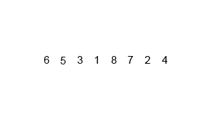

*Escrito originalmente em 05/01/2021*

No início dos estudos de computação e na carreira como programador, é essencial que além da lógica de programação e das estruturas comuns a todas as linguagens de programação (condicionais, loops de repetição, etc) seja aprofundado os conhecimentos em estruturas de dados e algoritmos.

<!--truncate-->

Porém, há alguns conceitos que farão sentido apenas quando o programador começar a se envolver em projetos reais, onde pessoas utilizarão os sistemas criados por ele e diversos fatores entram em jogo, sendo um dos principais a performance e velocidade das aplicações.

Os códigos escritos por desenvolvedores de software incluem não só toda a lógica necessária para seu funcionamento, mas também há o fator de subjetividade, sendo possível perceber as decisões e o modo de pensar do programador. Sabendo disso, a complexidade assintótica descreve o ponto de partida para a análise performática de algoritmos.

# Tabela de Tópicos
- [**Complexidade assintótica e Big O**](#complexidade-assintótica-e-big-o)
- [**Comparação entre algoritmos**](#comparação-entre-algoritmos)

## Complexidade assintótica e Big O
Na ciência da computação, a complexidade assintótica é o estudo da velocidade de execução de algoritmos dado o fator de crescimento do número de inputs. Vale mencionar que a complexidade assintótica precede de análises puramente teóricas e matemáticas, não levando em considaração detalhes de tecnologias e/ou linguagens de programação.

O Big O é uma notação criada para simplificar todo o entendimento da complexidade assintótica de algoritmos. Considerando uma quantia n, o Big O classifica algoritmos conforme o tempo de execução cresce dado que n tende ao infinito, demonstrando todo o processo por gráficos de funções.

O gráfico acima demonstra os valores do Big O mais comuns para algoritmos. Percebe-se que O(n log n) e O(n) possuem um crescimento constante do tempo de execução conforme o número de inputs cresce, por exemplo. Algoritmos de O(n²) para cima devem ser evitados, pois o tempo se torna exponencial e, em casos de um grande número de entradas, o tempo de resposta não será satisfatório. A exponencialidade geralmente está conectada com processos do algoritmo, sendo o mais comum deles a execução de um laço de repetição dentro de outro, o que causa intenso processamento e consequentemente lentidão.

## Comparação entre algoritmos

Como exemplo prático, foi selecionado 3 algoritmos de ordenação de listas bem conhecidos. Como o intuito não é os algoritmos em si, apenas será considerado uma breve explicação deles.

O Bubble Sort é um dos algoritmos de ordenação mais básicos. Consiste em trocar elementos adjacentes quando estes tiverem trocados, e ir repetindo o processo até toda a lista estiver ordenada.

O Quick Sort utiliza um elemento pivô para separar a lista em elementos menores que o pivô na esquerda e elementos maiores que o pivô na direita, seguindo a mesma lógica recursivamente para as sublistas de ambos os lados.

O Merge Sort separa a lista até o menor tamanho possível (é criado uma lista para cada elemento singular). Após isso as listas adjacentes são unidas e o array é ordenado recursivamente.

Os 3 algoritmos foram submetidos a uma bateria de testes com as mesmas listas. O conjunto utilizado foi um array de 100 valores, um de 1.000 valores, um de 10.000 valores, um de 100.000 valores e um especial de 10.000 valores que já está completamente ordenado.

Eis a performance deles (lembrando que 1 s = 10^-3 ms = 10^-6 µs):

O Bubble Sort, por ser mais simples, tem um desempenho muito baixo em listas grandes, chegando no O(n²) em seus piores casos. Entretanto, numa lista já ordenada ele é o que melhor performa, devido ao fato que ele apenas passa por toda a lista sem realizar nenhuma operação.

O Quick Sort possui a melhor performance conforme o número de entradas cresce, porém numa lista já ordenada sua lógica não se sai muito bem.

O Merge Sort apresenta a melhor performance média, conseguindo lidar com listas grandes de forma satisfatória sem perder desempenho em casos onde a lista já está ordenada.

O exercício de análise de algoritmos é aperfeiçoado conforme a prática e o poder de decisão e de confiança adquirido por quem utiliza-se do Big O certamente agrega na autonomia do desenvolvedor e no seu potencial de impactar ainda mais com suas soluções.

A implementação dos algoritmos foi realizada utilizando Golang e pode ser consultada em meu Github: [https://github.com/LuanSilveiraSouza/golang-algs-and-data-struts](https://github.com/LuanSilveiraSouza/golang-algs-and-data-struts)